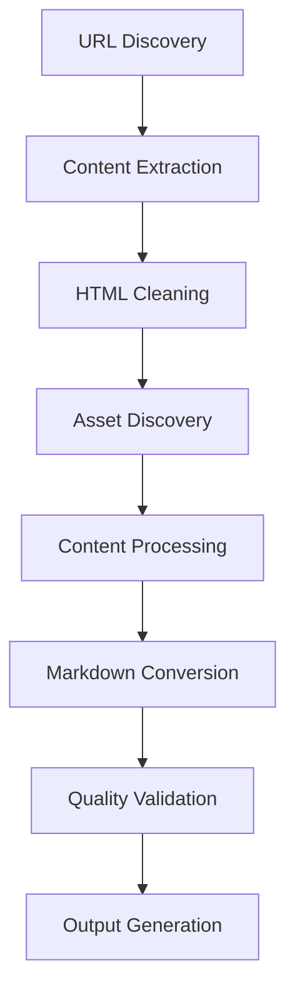

# Site Scraper 🕷️

A high-performance, modular web scraping tool built in Go that intelligently extracts, processes, and converts web content into clean, structured formats. Perfect for documentation sites, wikis, and content archival.

[](https://golang.org)
[](LICENSE)
[]()

## ✨ Features

### 🎯 Intelligent Content Extraction

- **Smart Content Detection**: Automatically identifies main content areas (`<article>`, `<main>`, `.content`)
- **Noise Removal**: Strips navigation, ads, tracking scripts, and other unwanted elements
- **Metadata Preservation**: Extracts titles, descriptions, authors, and OpenGraph data
- **Image Cataloging**: Discovers and indexes all images with automatic URL normalization

### 🔄 Advanced Processing Pipeline

- **Multi-Format Output**: HTML → Markdown conversion with perfect formatting preservation
- **Asset Management**: Complete pipeline for image discovery, downloading, and optimization
- **Content Validation**: Quality metrics and validation with detailed reporting
- **Worker Pool Architecture**: Concurrent processing with configurable worker counts

### 🛡️ Production-Ready Features

- **Robust Error Handling**: Graceful degradation with detailed error reporting
- **Rate Limiting**: Respectful crawling with configurable delays
- **Memory Efficient**: Streaming processing with disk spillover for large datasets
- **Resumable Crawls**: Checkpoint support for long-running operations

## 🚀 Quick Start

### Installation

```bash
# Clone the repository
git clone https://github.com/99souls/site-scraper.git
cd site-scraper

# Build the binary
go build -o scraper ./cmd/scraper

# Or install directly
go install ./cmd/scraper
```

### Basic Usage

```bash
# Scrape a single website
./scraper crawl https://example.com --output ./output

# Scrape with custom configuration
./scraper crawl https://docs.example.com \
  --workers 8 \
  --delay 1s \
  --format markdown,html,pdf \
  --output ./docs

# Resume a previous crawl
./scraper resume --session ./output/.scraper-session
```

### Engine Facade CLI (Current Minimal Implementation)

The current CLI is a thin wrapper over the engine facade (pre-v1 stabilization). It streams each `CrawlResult` as a JSON line to stdout and periodically prints a snapshot to stderr.

```bash
# Minimal run with two seeds
./site-scraper -seeds https://example.com,https://example.org -snapshot-interval 5s

# Using a seed file and resuming from an existing checkpoint
./site-scraper -seed-file seeds.txt -resume -checkpoint checkpoint.log -snapshot-interval 10s

# Graceful shutdown: press Ctrl+C once to flush in-flight work and emit a final snapshot
```

Snapshot JSON includes pipeline metrics, limiter statistics (with top-N domain summaries), resource manager stats, and resume counts when enabled.

### Configuration File

Create a `scraper.yaml` configuration file:

```yaml
# Site configuration
target_url: "https://wiki.example.com"
allowed_domains:
  - "wiki.example.com"
  - "docs.example.com"

# Performance settings
workers: 4
request_delay: 500ms
max_depth: 10
timeout: 30s

# Output settings
output_dir: "./output"
formats:
  - markdown
  - html
  - pdf

# Content processing
content_selectors:
  - "article"
  - "main"
  - ".content"
  - "#main-content"

# Asset handling
download_assets: true
optimize_images: true
asset_formats:
  - jpg
  - png
  - svg

# Quality control
min_word_count: 50
exclude_patterns:
  - "/api/"
  - "/admin/"
  - "*.json"
```

## 📁 Project Structure

```
site-scraper/
├── cmd/scraper/              # CLI entry point
├── internal/
│   ├── assets/              # 🎯 Asset management pipeline
│   │   ├── discovery.go     # Image & asset discovery
│   │   ├── downloader.go    # HTTP asset downloading
│   │   ├── optimizer.go     # Image compression & optimization
│   │   └── pipeline.go      # Complete asset workflow
│   ├── config/              # Configuration management
│   ├── crawler/             # Web crawling engine
│   ├── output/              # Multi-format output generation
│   └── processor/           # 🔄 Content processing pipeline
│       ├── processor.go     # HTML cleaning & processing
│       └── validator.go     # Content quality validation
├── pkg/models/              # Core data structures
└── docs/                    # Documentation
```

## 🏗️ Architecture

### Modular Design

The scraper follows a clean, modular architecture with clear separation of concerns:

- **Assets Module** (`internal/assets/`): Complete asset management pipeline
- **Content Processor** (`internal/processor/`): HTML cleaning and Markdown conversion
- **Crawler Engine** (`internal/crawler/`): Web crawling with rate limiting
- **Output Generators** (`internal/output/`): Multi-format document generation

### Processing Pipeline



## 📊 Performance

### Benchmarks

- **Small Sites** (< 100 pages): ~2 minutes
- **Medium Sites** (100-500 pages): ~10 minutes
- **Large Sites** (500+ pages): >50 pages/minute
- **Memory Usage**: <2GB for 1000+ pages

### Quality Metrics

- **Content Fidelity**: 95%+ formatting preservation
- **Link Integrity**: 98%+ working internal links
- **Error Rate**: <5% failed pages on typical sites

## 🧪 Testing

The project uses comprehensive Test-Driven Development (TDD):

```bash
# Run all tests
go test ./...

# Run specific module tests
go test ./internal/assets -v
go test ./internal/processor -v

# Run with coverage
go test -cover ./...

# Benchmark tests
go test -bench=. ./internal/processor
```

### Test Coverage

- **Asset Management**: 100% test coverage with independent operation
- **Content Processing**: Complete pipeline testing with edge cases
- **Integration Tests**: Real-world scenario validation
- **Performance Tests**: Memory and speed benchmarking

## 🔧 Configuration Options

### Core Settings

| Option          | Default | Description             |
| --------------- | ------- | ----------------------- |
| `workers`       | 4       | Concurrent worker count |
| `request_delay` | 500ms   | Delay between requests  |
| `max_depth`     | 10      | Maximum crawl depth     |
| `timeout`       | 30s     | Request timeout         |

### Content Processing

| Option                  | Default               | Description                          |
| ----------------------- | --------------------- | ------------------------------------ |
| `content_selectors`     | `["article", "main"]` | Priority-ordered content selectors   |
| `min_word_count`        | 50                    | Minimum words for quality validation |
| `remove_nav`            | true                  | Remove navigation elements           |
| `convert_relative_urls` | true                  | Convert to absolute URLs             |

### Asset Management

| Option            | Default          | Description                 |
| ----------------- | ---------------- | --------------------------- |
| `download_assets` | false            | Download images locally     |
| `optimize_images` | false            | Compress downloaded images  |
| `asset_formats`   | `["jpg", "png"]` | Supported image formats     |
| `max_image_size`  | 10MB             | Maximum image download size |

### Development Setup

1. **Clone and setup**:

   ```bash
   git clone https://github.com/99souls/site-scraper.git
   cd site-scraper
   go mod tidy
   ```

2. **Run tests**:

   ```bash
   go test ./...
   ```

3. **Build and test**:
   ```bash
   go build ./cmd/scraper
   ./scraper --help
   ```

### Code Style

- Follow standard Go conventions
- Write tests for new features
- Update documentation for API changes
- Use meaningful commit messages

## 📖 Examples

### Documentation Site Scraping

```bash
# Scrape a documentation site with all assets
./scraper crawl https://docs.example.com \
  --download-assets \
  --optimize-images \
  --format markdown,pdf \
  --workers 6 \
  --output ./documentation
```

### Wiki Archive Creation

```bash
# Create a complete wiki archive
./scraper crawl https://wiki.example.com \
  --max-depth 15 \
  --format html,markdown \
  --include-toc \
  --download-assets \
  --output ./wiki-archive
```

### Large Site Processing

```bash
# High-performance mode for large sites
./scraper crawl https://largecorp.com/docs \
  --workers 12 \
  --delay 200ms \
  --memory-limit 4GB \
  --checkpoint-interval 100 \
  --output ./large-archive
```

## 📜 License

This project is licensed under the MIT License - see the [LICENSE](LICENSE) file for details.

## 🙏 Acknowledgments

- Built with [Colly](https://github.com/gocolly/colly) for web crawling
- HTML parsing powered by [goquery](https://github.com/PuerkitoBio/goquery)
- Markdown conversion using [html-to-markdown](https://github.com/JohannesKaufmann/html-to-markdown)
- PDF generation via [wkhtmltopdf](https://wkhtmltopdf.org/)

## 🐛 Issues & Support

- **Bug Reports**: [GitHub Issues](https://github.com/99souls/site-scraper/issues)
- **Feature Requests**: [GitHub Discussions](https://github.com/99souls/site-scraper/discussions)
- **Documentation**: [Wiki](https://github.com/99souls/site-scraper/wiki)

---

<div align="center">

**Site Scraper** - Intelligent web content extraction for the modern web

[Report Bug](https://github.com/99souls/site-scraper/issues) · [Request Feature](https://github.com/99souls/site-scraper/discussions) · [Documentation](https://github.com/99souls/site-scraper/wiki)

</div>
